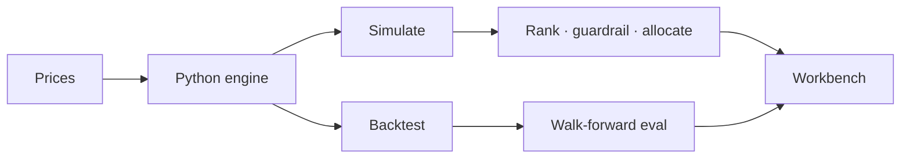

# Monte Carlo

Monte Carlo simulation and walk-forward validation. Next.js workbench over a Python engine with auditable price provenance.



## Start

```bash
python3 -m pip install -e .
npm install
npm run dev
```

Open `http://localhost:3000`.

## CLI

```bash
# Simulation
monte-carlo simulate AAPL MSFT --days 252 --scenarios 5000 --seed 42

# Walk-forward backtest
monte-carlo backtest AAPL MSFT --lookback 60 --hold 20 --rebalance 20

# Offline fixtures
monte-carlo simulate AAPL --source offline --data-path sample_data

# Decision-stability gate before capital is risked
monte-carlo evaluate evaluation_sets/sample-stability.json --output results/evaluation
```

Use `evaluate` to gate a decision across seeds and models before capital is risked.

## Architecture

| Layer | Role |
| --- | --- |
| `app/` | Next.js App Router and `/api/run` |
| `components/workbench/` | Browser UI |
| `lib/` | Types and Python bridge |
| `ui_bridge.py` | JSON bridge for the API route |
| `ui_state.py` | Presentation state builder |

**Data sources:** `auto`, `offline`, `online`. Local CSVs need `Date` and `Close`; fixtures live in `sample_data/`.

**Deploy:** Vercel-ready. See [docs/deploy.md](docs/deploy.md).

**Test:**

```bash
pytest -q
npm run typecheck
npm run build
```

MIT · [LICENSE](LICENSE)
