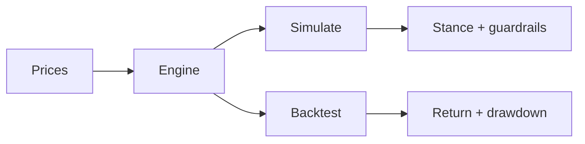

# Monte Carlo Decision Engine

Simulate forward outcomes. Validate the process on history. One engine, CLI and browser.



The main CLI has two commands:

- `monte-carlo simulate` for current opportunities
- `monte-carlo backtest` for walk-forward validation

Optional browser entrypoint:

- `monte-carlo-ui` for a lean browser UI

## Get started

```bash
python3 -m pip install -e .
monte-carlo simulate AAPL MSFT --days 252 --scenarios 5000 --seed 42
monte-carlo backtest AAPL MSFT --lookback 60 --hold 20 --rebalance 20
```

Browser UI:

```bash
python3 -m pip install -e .[ui]
monte-carlo-ui   # http://127.0.0.1:8000
```

## Workflow: simulate

```bash
monte-carlo simulate AAPL MSFT \
  --source offline \
  --data-path sample_data
```

### How to read the result

- `Stance` is the posture: lean in, selective, defensive, or stand aside.
- `Data source` tells you whether the run used live prices, local CSVs, or a fallback.
- `Top idea` is the first name to inspect; the suggested weight is a sizing hint, not an order.
- `Avoid` and `Cash buffer` are guardrails. Treat them as a signal to pass or keep more capital idle.

## Workflow: backtest

The bundled `sample_data` history is intentionally short, so use a short walk-forward window for the offline example.

```bash
monte-carlo backtest AAPL \
  --source offline \
  --data-path sample_data \
  --lookback 5 \
  --hold 3 \
  --rebalance 3 \
  --top 1 \
  --scenarios 10
```

### How to read the result

- `Strategy return` is the outcome of the full rebalance process.
- `Max drawdown` is the deepest peak-to-trough loss; smaller is easier to hold.
- `vs equal weight` asks whether the process beat a simple own-everything baseline.
- `vs cash` asks whether taking market risk paid for itself.
- Saved backtest folders also include `price_sources.json` so the origin of the prices survives the run.

## Reference

**Data.** `--source auto | offline | online`. Local CSVs need `Date` and `Close`; defaults live in `sample_data/`.

**Outputs.** Use `--output DIR` to persist artifacts — see [docs/output-guide.md](docs/output-guide.md).

**Deploy.** Browser UI is Vercel-ready. See [docs/deploy.md](docs/deploy.md).

**Migration.**

- `python cli.py ...` -> `monte-carlo simulate ...`
- `python backtest.py ...` -> `monte-carlo backtest ...`
- `python MonteCarlo.py --ticker AAPL` -> `monte-carlo simulate AAPL --show`

**Test.**

```bash
uv run --with pytest pytest -q
```

MIT · [LICENSE](LICENSE)
