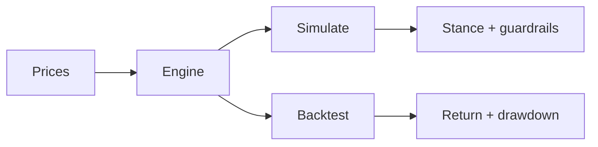

# Monte Carlo Decision Engine

Simulate forward outcomes. Validate the process on history. One engine, CLI and browser.



## Get started

```bash
python3 -m pip install -e .
monte-carlo simulate AAPL MSFT --days 252 --scenarios 5000 --seed 42
monte-carlo backtest AAPL MSFT --lookback 60 --hold 20 --rebalance 20
```

Browser UI:

```bash
python3 -m pip install -e .[ui]
monte-carlo-ui   # http://127.0.0.1:8000
```

Offline, deterministic run:

```bash
monte-carlo simulate AAPL --source offline --data-path sample_data
```

## Overview

| Command | Question it answers |
| :-- | :-- |
| `simulate` | What stance fits these names right now? |
| `backtest` | Did this process hold up on past data? |

**Simulate** returns a stance (lean in, selective, defensive, stand aside), a top idea, and guardrails when conviction or data quality is weak.

**Backtest** returns strategy return, max drawdown, and comparisons to equal weight and cash. Add `--details` for the full metric table. Use `--output DIR` to persist artifacts — see [docs/output-guide.md](docs/output-guide.md).

## Reference

**Data.** `--source auto | offline | online`. Local CSVs need `Date` and `Close`; defaults live in `sample_data/`.

**Deploy.** Browser UI is Vercel-ready. See [docs/deploy.md](docs/deploy.md).

**Test.**

```bash
uv run --with pytest pytest -q
```

MIT · [LICENSE](LICENSE)
