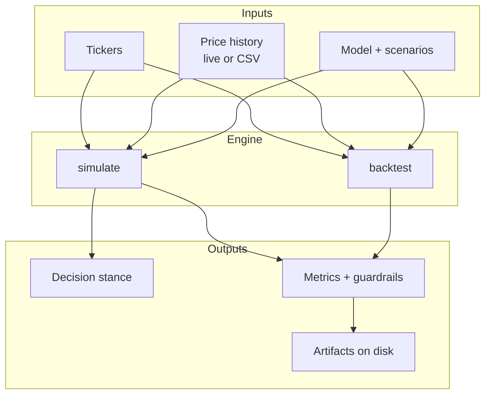

# Monte Carlo Decision Engine

Forward simulation and walk-forward backtesting for portfolio decisions. The same core engine powers a CLI, an optional browser UI, and a Vercel-ready deployment surface.

## System overview



## Capabilities

| Mode | Purpose | Primary output |
| --- | --- | --- |
| `simulate` | Evaluate current opportunities | Stance, top idea, avoid list, cash buffer |
| `backtest` | Validate the process historically | Strategy return, drawdown, baseline comparison |
| `monte-carlo-ui` | Interactive exploration | Same engine through a browser |

## Install

Python 3.9+ required.

```bash
python3 -m pip install -e .          # CLI
python3 -m pip install -e .[ui]      # CLI + browser UI
```

## Quick start

CLI:

```bash
monte-carlo simulate AAPL MSFT --days 252 --scenarios 5000 --model gbm --seed 42
monte-carlo backtest AAPL MSFT --lookback 60 --hold 20 --rebalance 20 --scenarios 1000
```

Browser UI:

```bash
monte-carlo-ui
# http://127.0.0.1:8000 — opens with bundled AAPL demo data
```

Offline deterministic run:

```bash
monte-carlo simulate AAPL MSFT --source offline --data-path sample_data
```

## Reading results

**Simulate**

- **Stance** — portfolio posture: lean in, selective, defensive, or stand aside
- **Top idea** — first name to inspect; weight is a sizing hint, not an order
- **Avoid / cash buffer** — guardrails when conviction or data quality is weak

**Backtest**

- **Strategy return** — outcome of the rebalance process
- **Max drawdown** — peak-to-trough loss across the window
- **vs equal weight / vs cash** — benchmarks for process quality

Add `--details` for full metric tables. Use `--output DIR` to persist artifacts; see [docs/output-guide.md](docs/output-guide.md).

## Data sources

| `--source` | Behavior |
| --- | --- |
| `auto` | Live prices first, local CSV fallback |
| `offline` | Local CSV only |
| `online` | Live prices only |

Local CSVs need `Date` and `Close` columns. Defaults: `sample_data/<TICKER>.csv` (bundled `AAPL.csv`, `MSFT.csv`).

## Deployment

The browser UI ships with `vercel.json`, `requirements-ui.txt`, and Python 3.12 pinned in `.python-version`.

```bash
python3 -m pip install -r requirements-ui.txt
vercel dev
vercel deploy --prod
```

See [docs/deploy.md](docs/deploy.md) for operational limits.

## Testing

```bash
uv run --with pytest pytest -q
```

## License

MIT. See [LICENSE](LICENSE).
